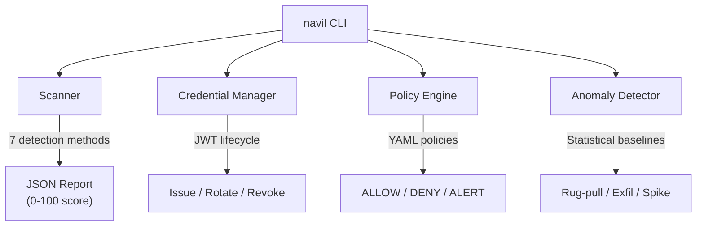

# Navil

[](https://github.com/navil-dev/navil/actions/workflows/ci.yml)
[](https://www.python.org/downloads/)
[](LICENSE)

Supply-chain security toolkit for [Model Context Protocol (MCP)](https://modelcontextprotocol.io/) servers. Scans configurations for vulnerabilities, manages agent credentials, enforces runtime security policies, and detects behavioral anomalies.

> Developed by **[Pantheon Lab Limited](https://pantheonlab.ai)**.

## Architecture



## Features

- **Configuration Scanning** -- Detect plaintext credentials, over-privileged permissions, missing authentication, unverified sources, and malicious patterns. Produces a 0-100 security score.
- **Credential Lifecycle** -- Issue, rotate, and revoke JWT tokens with JIT provisioning, configurable TTL, usage tracking, and immutable audit logs.
- **Policy Enforcement** -- YAML-driven tool/action allow-lists, per-agent rate limiting, data-sensitivity gates, and suspicious-pattern detection.
- **Anomaly Detection** -- Statistical behavioral baselines with rug-pull detection, data exfiltration alerts, rate spike monitoring, and privilege escalation warnings.

## Installation

```bash
pip install navil
```

Or from source:

```bash
git clone https://github.com/navil-dev/navil.git
cd navil
pip install -e ".[dev]"
```

Requires **Python 3.10+**.

## Quick Start

### Scan an MCP configuration

```bash
navil scan config.json
```

### Issue a short-lived credential

```bash
navil credential issue --agent my-agent --scope "read:tools" --ttl 3600
```

### Check a policy decision

```bash
navil policy check --tool file_system --agent my-agent --action read
```

### Generate a security report

```bash
navil report -o report.json
```

## Commands

| Command | Description |
|---------|-------------|
| `navil scan <config>` | Scan MCP config for vulnerabilities |
| `navil credential issue` | Issue a new JWT credential |
| `navil credential revoke` | Revoke an active credential |
| `navil credential list` | List credentials with filters |
| `navil policy check` | Evaluate a tool call against policy |
| `navil monitor start` | Start monitoring mode |
| `navil report` | Generate security report |

## Development

```bash
# Install dev dependencies
pip install -e ".[dev]"

# Run tests
pytest

# Lint
ruff check .

# Type check
mypy mcp_guardian
```

## Contributing

See [CONTRIBUTING.md](CONTRIBUTING.md) for development setup, coding standards, and how to submit changes.

## Security

See [SECURITY.md](SECURITY.md) for our vulnerability disclosure policy.

## License

[Apache License 2.0](LICENSE) -- Copyright 2026 Pantheon Lab Limited.
