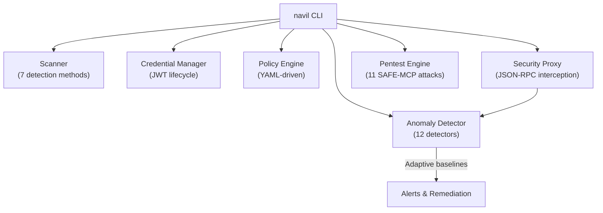

# Navil

[](https://github.com/ivanlkf/navil/actions/workflows/ci.yml)
[](https://www.python.org/downloads/)
[](LICENSE)

Supply-chain security toolkit for [Model Context Protocol (MCP)](https://modelcontextprotocol.io/) servers. Scans configurations for vulnerabilities, manages agent credentials, enforces runtime policies, detects behavioral anomalies, intercepts live traffic through a security proxy, and validates defenses with automated penetration testing.

> Developed by **[Pantheon Lab Limited](https://pantheonlab.ai)**.

## Features

- **Configuration Scanning** — Detect plaintext credentials, over-privileged permissions, missing authentication, unverified sources, and malicious patterns. Produces a 0-100 security score.
- **Credential Lifecycle** — Issue, rotate, and revoke JWT tokens with JIT provisioning, configurable TTL, usage tracking, and immutable audit logs.
- **Policy Enforcement** — YAML-driven tool/action allow-lists, per-agent rate limiting, data-sensitivity gates, and suspicious-pattern detection.
- **Anomaly Detection** — 12 statistical behavioral detectors: rug-pull, data exfiltration, rate spike, privilege escalation, reconnaissance, persistence, defense evasion, lateral movement, C2 beaconing, and supply chain attacks.
- **Real-Time Proxy** — MCP security proxy that intercepts JSON-RPC traffic between agents and servers, running all 12 anomaly detectors on live invocations.
- **Penetration Testing** — 11 SAFE-MCP attack simulations that validate your detectors actually catch threats. No real network traffic generated.

## Architecture



## Installation

```bash
pip install navil
```

With optional features:

```bash
pip install navil[ml]         # + ML anomaly detection (Isolation Forest, clustering)
pip install navil[all]        # Everything
```

Or from source:

```bash
git clone https://github.com/ivanlkf/navil.git
cd navil
pip install -e ".[dev]"
```

Requires **Python 3.10+**.

## Quick Start

### Scan an MCP configuration

```bash
navil scan config.json
```

### Run penetration tests

```bash
navil pentest                               # All 11 SAFE-MCP attack simulations
navil pentest --scenario reconnaissance     # Single scenario
navil pentest --json -o report.json         # JSON output for CI
```

### Start the security proxy

```bash
pip install fastapi uvicorn httpx
navil proxy start --target http://localhost:3000
```

### Issue a short-lived credential

```bash
navil credential issue --agent my-agent --scope "read:tools" --ttl 3600
```

### Check a policy decision

```bash
navil policy check --tool file_system --agent my-agent --action read
```

## Commands

| Command | Description |
|---------|-------------|
| `navil scan <config>` | Scan MCP config for vulnerabilities (0-100 score) |
| `navil pentest` | Run SAFE-MCP penetration tests (11 attack scenarios) |
| `navil proxy start` | Start MCP security proxy with live interception |
| `navil credential issue` | Issue a new JWT credential |
| `navil credential revoke` | Revoke an active credential |
| `navil credential list` | List credentials with filters |
| `navil policy check` | Evaluate a tool call against policy |
| `navil monitor start` | Start anomaly monitoring mode |
| `navil report` | Generate security report |

## Navil Cloud

Looking for a web dashboard, LLM-powered analysis, or hosted deployment? See [Navil Cloud](https://navil.ai) for the commercial offering with:

- React-based fleet monitoring dashboard
- AI-powered config analysis, anomaly explanation, and self-healing
- Stripe billing and Clerk authentication
- One-click Railway deployment

## Development

```bash
# Install dev dependencies
pip install -e ".[dev]"

# Run tests
pytest

# Lint
ruff check .

# Type check
mypy navil
```

## Contributing

See [CONTRIBUTING.md](CONTRIBUTING.md) for development setup, coding standards, and how to submit changes.

## Security

See [SECURITY.md](SECURITY.md) for our vulnerability disclosure policy.

## License

Licensed under [Apache 2.0](LICENSE) — free to use, modify, and redistribute for any purpose.
