# Navil

[](https://github.com/ivanlkf/navil/actions/workflows/ci.yml)
[](https://www.python.org/downloads/)
[](LICENSE)

Supply-chain security toolkit for [Model Context Protocol (MCP)](https://modelcontextprotocol.io/) servers. Scans configurations for vulnerabilities, manages agent credentials, enforces runtime policies, detects behavioral anomalies, intercepts live traffic through a security proxy, and validates defenses with automated penetration testing.

> Developed by **[Pantheon Lab Limited](https://pantheonlab.ai)**.

<p align="center">
  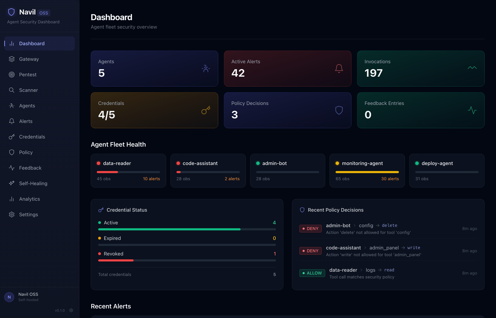
</p>

## Features

- **Configuration Scanning** — Detect plaintext credentials, over-privileged permissions, missing authentication, unverified sources, and malicious patterns. Produces a 0-100 security score.
- **Credential Lifecycle** — Issue, rotate, and revoke JWT tokens with JIT provisioning, configurable TTL, usage tracking, and immutable audit logs.
- **Policy Enforcement** — YAML-driven tool/action allow-lists, per-agent rate limiting, data-sensitivity gates, and suspicious-pattern detection.
- **Anomaly Detection** — 12 statistical behavioral detectors: rug-pull, data exfiltration, rate spike, privilege escalation, reconnaissance, persistence, defense evasion, lateral movement, C2 beaconing, and supply chain attacks.
- **Real-Time Proxy** — MCP security proxy that intercepts JSON-RPC traffic between agents and servers, running all 12 anomaly detectors on live invocations.
- **Penetration Testing** — 11 SAFE-MCP attack simulations that validate your detectors actually catch threats. No real network traffic generated.
- **LLM Analysis** — AI-powered config analysis, anomaly explanation, policy generation, and self-healing. Bring your own key (Anthropic, OpenAI, Gemini, Ollama).
- **Cloud Dashboard** — React-based fleet monitoring dashboard with alerting, gateway traffic visualization, credential management, and pentest UI.

## Dashboard

Navil ships with a full-featured security dashboard for visualizing and managing your MCP fleet.

<table>
<tr>
<td width="50%">

**Penetration Testing** — Run all 11 SAFE-MCP attack scenarios and see which threats your detectors catch.

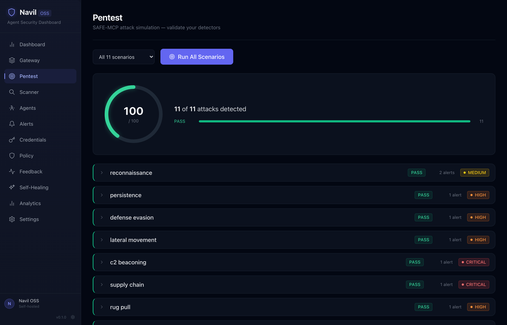

</td>
<td width="50%">

**Config Scanner** — Paste any MCP server config and get a security score with actionable findings.

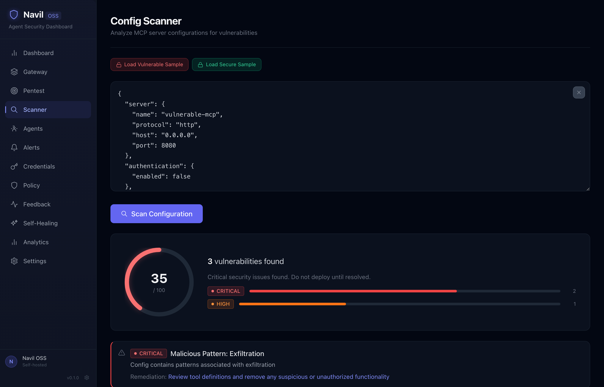

</td>
</tr>
<tr>
<td width="50%">

**Self-Healing AI** — LLM-powered threat analysis with one-click remediation actions.

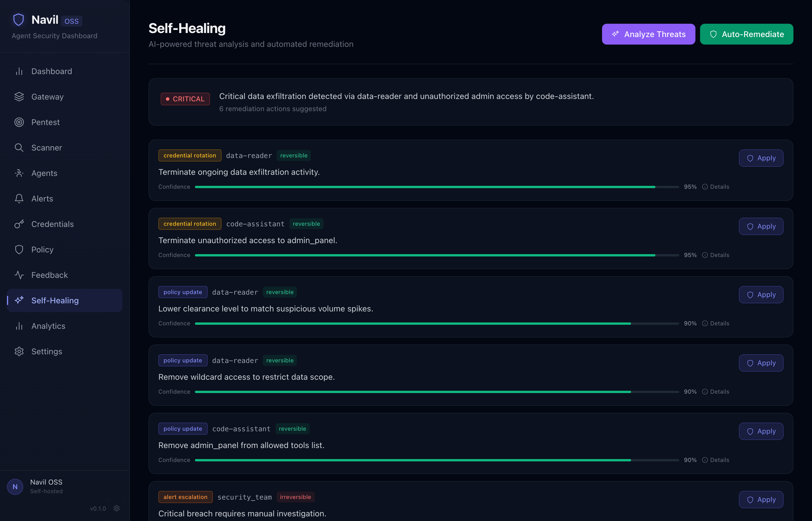

</td>
<td width="50%">

**Alerts** — Real-time anomaly alerts with severity filtering across your agent fleet.

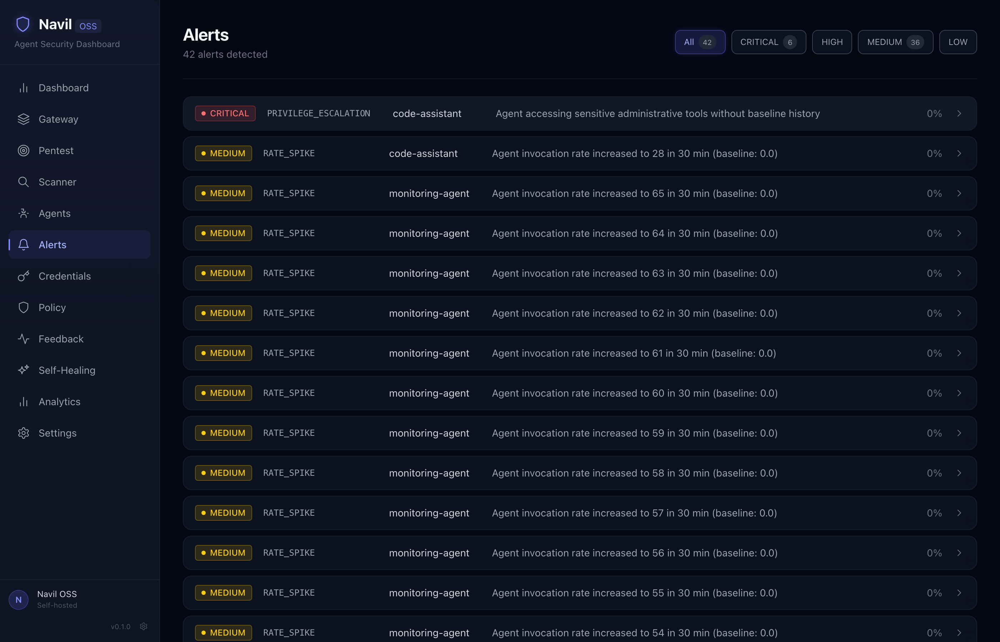

</td>
</tr>
<tr>
<td width="50%">

**Policy Engine** — Check permissions, review decisions, and generate YAML policies with AI.

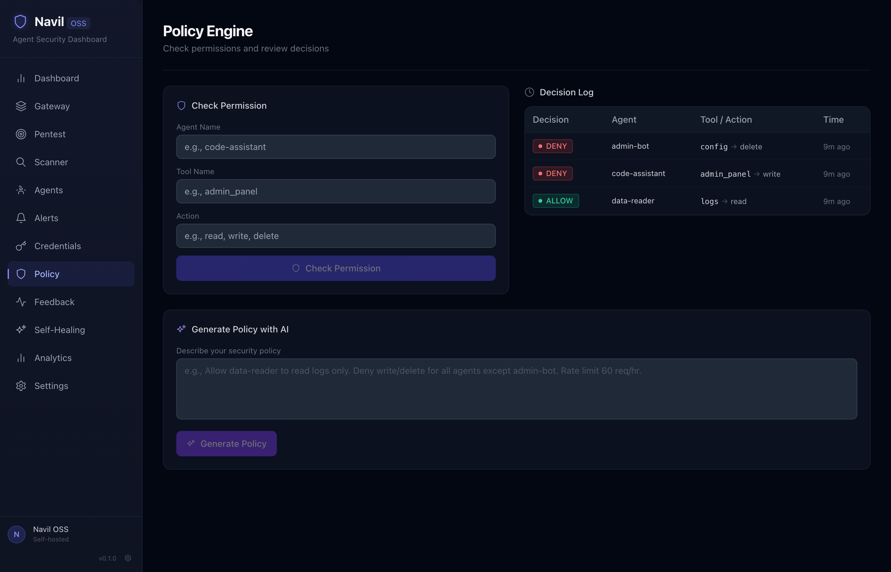

</td>
<td width="50%">

**Gateway** — MCP security proxy with real-time traffic monitoring and interception.

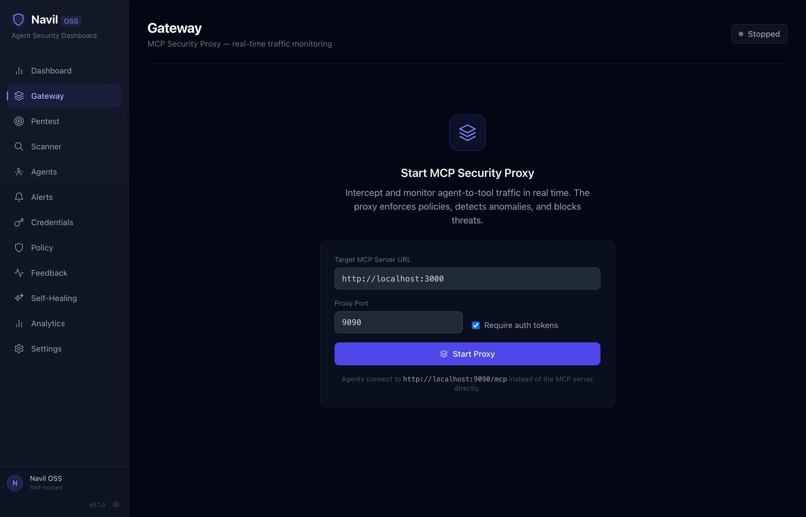

</td>
</tr>
</table>

<details>
<summary>More screenshots</summary>

| Page | Screenshot |
|------|-----------|
| Agents | 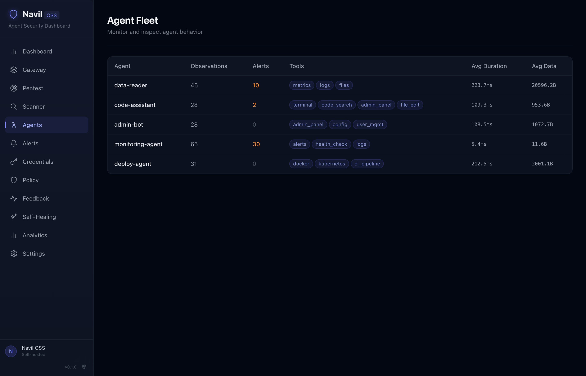 |
| Credentials | 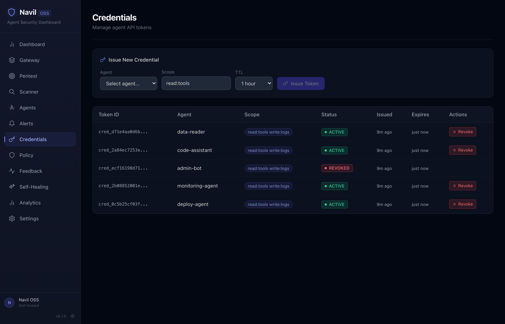 |
| Analytics | 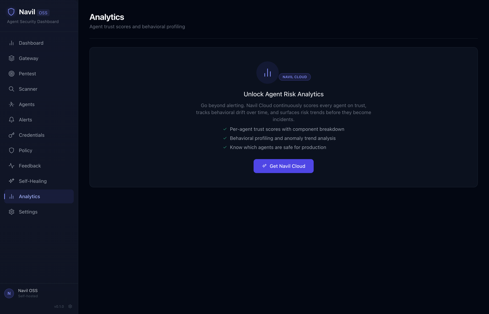 |
| Settings | 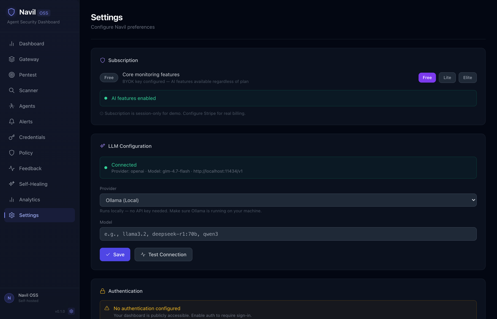 |

</details>

## Architecture

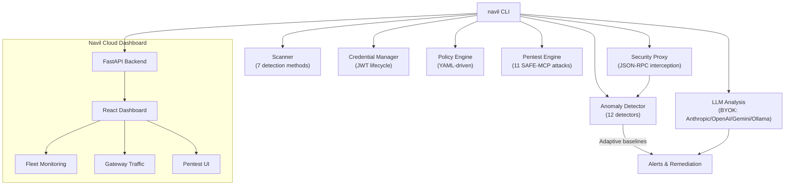

## Installation

```bash
pip install navil
```

With optional features:

```bash
pip install navil[llm]         # + AI-powered analysis (Anthropic, OpenAI, Gemini)
pip install navil[cloud]       # + Cloud dashboard (FastAPI + React)
pip install navil[ml]          # + ML anomaly detection (Isolation Forest, clustering)
pip install navil[all]         # Everything
```

Or from source:

```bash
git clone https://github.com/ivanlkf/navil.git
cd navil
pip install -e ".[dev]"
```

Requires **Python 3.10+**.

## Quick Start

### Scan an MCP configuration

```bash
navil scan config.json
```

### Run penetration tests

```bash
navil pentest                               # All 11 SAFE-MCP attack simulations
navil pentest --scenario reconnaissance     # Single scenario
navil pentest --json -o report.json         # JSON output for CI
```

### Start the security proxy

```bash
navil proxy start --target http://localhost:3000
```

### Launch the dashboard

```bash
pip install navil[cloud]
navil cloud serve    # Opens at http://localhost:8484
```

The dashboard is open by default (no login required). To enable authentication:

```bash
VITE_NAVIL_AUTH=true navil cloud serve        # Local email auth
VITE_CLERK_PUBLISHABLE_KEY=pk_... navil cloud serve  # Clerk SSO/OAuth
```

### AI-powered analysis (BYOK)

```bash
# Uses ANTHROPIC_API_KEY env var automatically
navil llm analyze-config config.json

# Or specify provider explicitly
navil llm generate-policy "only allow read access to logs" --provider gemini
navil llm explain-anomaly '{"type": "rate_spike", "agent": "bot-1"}' --provider openai
```

Ollama is also supported for fully local, offline AI analysis:

```bash
navil cloud serve
# Then configure in Settings: provider=openai, base_url=http://localhost:11434/v1, model=llama3.2
```

### Issue a short-lived credential

```bash
navil credential issue --agent my-agent --scope "read:tools" --ttl 3600
```

### Check a policy decision

```bash
navil policy check --tool file_system --agent my-agent --action read
```

## Commands

| Command | Description |
|---------|-------------|
| `navil scan <config>` | Scan MCP config for vulnerabilities (0-100 score) |
| `navil pentest` | Run SAFE-MCP penetration tests (11 attack scenarios) |
| `navil proxy start` | Start MCP security proxy with live interception |
| `navil proxy stop` | Stop the running proxy |
| `navil cloud serve` | Launch Navil Cloud dashboard |
| `navil credential issue` | Issue a new JWT credential |
| `navil credential revoke` | Revoke an active credential |
| `navil credential list` | List credentials with filters |
| `navil policy check` | Evaluate a tool call against policy |
| `navil monitor start` | Start anomaly monitoring mode |
| `navil report` | Generate security report |
| `navil llm analyze-config` | AI-powered config analysis |
| `navil llm explain-anomaly` | AI-powered anomaly explanation |
| `navil llm generate-policy` | Generate policy from natural language |
| `navil llm suggest-healing` | AI-powered remediation suggestions |

## Development

```bash
# Install dev dependencies
pip install -e ".[dev]"

# Run tests
pytest

# Lint
ruff check .

# Type check
mypy navil

# Dashboard (requires Node.js 20+)
cd dashboard && npm install && npm run dev
```

## Contributing

See [CONTRIBUTING.md](CONTRIBUTING.md) for development setup, coding standards, and how to submit changes.

## Security

See [SECURITY.md](SECURITY.md) for our vulnerability disclosure policy.

## License

Navil uses a dual-license model:

| Component | License |
|-----------|---------|
| Core CLI (`navil/scanner.py`, `navil/credential_manager.py`, `navil/policy_engine.py`, `navil/anomaly_detector.py`, `navil/pentest.py`, `navil/proxy.py`, `navil/cli.py`, `navil/adaptive/`, `navil/ml/`) | [Apache 2.0](LICENSE) |
| Cloud dashboard, LLM features, API server (`navil/cloud/`, `navil/llm/`, `dashboard/`) | [Business Source License 1.1](LICENSE.cloud) |

**Apache 2.0** — free to use, modify, and redistribute for any purpose.

**BSL 1.1** — free for internal use and self-hosting. You may not offer the Licensed Work as a competing hosted service. Each release converts to Apache 2.0 four years after its publication date.

Commercial licensing enquiries: info@pantheonlab.ai
